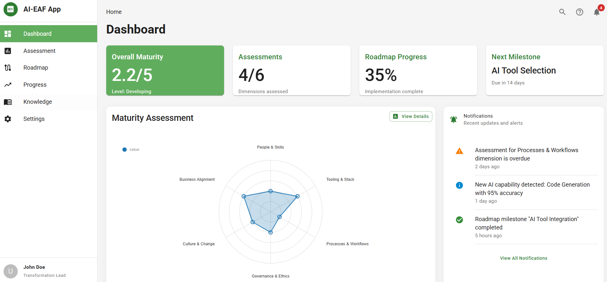
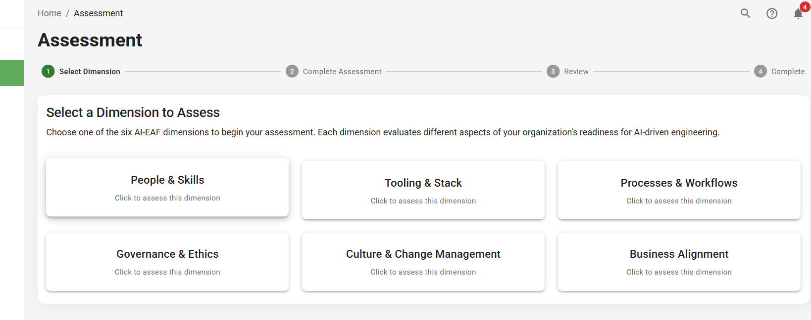

# AI-EAF Implementation Application

The AI-EAF Implementation App is a digital platform designed to guide organizations through their AI engineering transformation journey using the AI Engineering Adaptation Framework.

## Purpose

The application provides a structured, interactive approach to implementing the AI-EAF, helping organizations to:

- Assess their current engineering capabilities across all six dimensions
- Generate customized transformation roadmaps based on assessment results
- Track progress through the maturity model with clear metrics and visualizations
- Access knowledge resources and implementation best practices
- Facilitate collaboration among transformation stakeholders
- Adapt strategies based on evolving AI capabilities and organizational needs

## Key Features

### 1. Assessment Engine
- Interactive questionnaires to evaluate current state across all six dimensions
- Automated gap analysis identifying strengths and improvement areas
- Visual dashboard representing maturity levels across dimensions
- Benchmarking against industry standards or previous assessments

### 2. Transformation Roadmap Generator
- Customized transformation plans based on assessment results
- Milestone creation with realistic timelines
- Initiative prioritization based on impact and feasibility
- Resource estimation and dependency mapping

### 3. Progress Tracking
- Implementation monitoring against the roadmap
- KPI dashboard with key performance indicators
- Status reporting for stakeholders
- Trend analysis showing maturity progression over time

### 4. Knowledge Repository
- Interactive access to AI-EAF components and methodology
- Curated collection of implementation best practices
- Case studies of successful AI engineering transformations
- Templates, guides, and tools for each dimension

### 5. Collaboration Tools
- Shared workspace for transformation team collaboration
- Stakeholder management and engagement tools
- Task assignment and tracking
- Discussion forums and notification system

### 6. Adaptability Management
- Scenario planning for different AI evolution trajectories
- Risk assessment and mitigation planning
- Horizon scanning for emerging trends
- Adaptive roadmap adjustment based on new developments

## Screenshots

Below are screenshots of the AI-EAF Implementation App prototype:

### Main Dashboard

*The main dashboard provides a comprehensive overview of the organization's AI engineering transformation journey, featuring key metrics, recent activities, and quick access to all major application functions. It serves as the central hub for monitoring transformation progress and accessing critical insights at a glance.*

### Assessment Dashboard

*The assessment dashboard provides a visual overview of an organization's current maturity levels across all six dimensions of the AI-EAF, highlighting strengths and areas for improvement.*

### Transformation Roadmap

*The transformation roadmap generator creates a customized plan with key milestones based on assessment results, enabling strategic planning and resource allocation.*

### Progress Tracking

*The progress tracking feature allows organizations to monitor their transformation journey with clear metrics and visualizations, ensuring accountability and continuous improvement.*

## Development Status

The AI-EAF Implementation App is currently in development. The application is being designed with enterprise needs in mind, featuring:

- Secure cloud-based architecture with on-premises deployment options
- Integration capabilities with existing enterprise systems
- Robust data security and privacy controls
- Scalable infrastructure to support organizations of all sizes
- Mobile-responsive design for access across devices

## Getting Involved

Organizations interested in participating in the beta testing program or contributing to the application development can contact [Markus Schmidberger](mailto:markus@turtletrafo.de) for more information.
